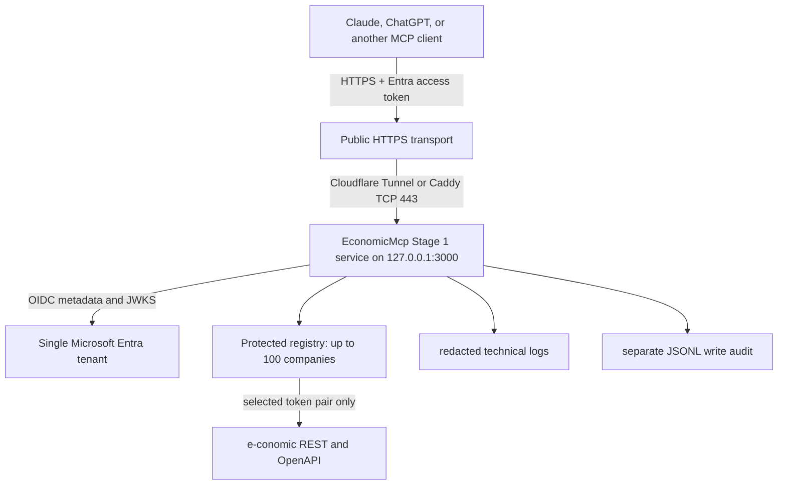

# Stage 1 architecture

## Runtime flow

The Windows host is a standalone internet-connected runtime. It does not use
the corporate LAN, domain join, Windows integrated authentication, internal DNS,
or a VPN. The selected public transport is either Cloudflare Tunnel or Caddy on
the standalone host. Neither transport makes authorization decisions for the
application. The Node process verifies Entra tokens itself.

## Control flow

Every request crosses independent controls:

1. The Stage 1 server registers only the 16 names in `STAGE1_ALLOWED_TOOLS`.
2. Signed, tenant-specific Entra claims and the requested tool are authorized on
   every invocation. `Economic.Reader` can read; `Economic.DraftCreator` can also
   call the two draft tools.
3. `stage1_list_companies` filters the registry by Entra user object ID. Every
   business tool requires an explicit `companyId`, then creates a client with
   only that company's token pair.
4. The Stage 1 policy permits only `POST /invoices/drafts` and
   `POST /draft-entries`; all other mutations remain denied even if another
   layer fails.
5. Immediately before either mutation, `/self` must return the selected
   registry entry's agreement number. Live acceptance is additionally locked to
   `1382005`.

Reads are on demand, bounded, and catalog-validated. No accounting replica,
vector database, webhook ingestion, or approval database is introduced.
e-conomic remains the system of record and its draft UI is the human approval
boundary.

## Components reused from upstream

The profile reuses the upstream e-conomic client, REST/OpenAPI service catalog,
endpoint materialization, payload normalization, prepared-operation verification,
policy engine, JSONL audit writer, MCP transports, and Vitest fixtures. Customer
logic is isolated under `src/stage1`, `src/acceptance`, the Stage 1 HTTP entry
point, and deployment configuration.

## Availability dependencies

Authentication needs internet access to the tenant-specific Microsoft OIDC/JWKS
endpoints. Business operations need e-conomic HTTPS. Public reachability needs
the configured Cloudflare or Caddy transport. A failure of any dependency fails
the affected request; it never falls back to unsigned claims, another tenant, a
different e-conomic host, or a broader tool profile.
